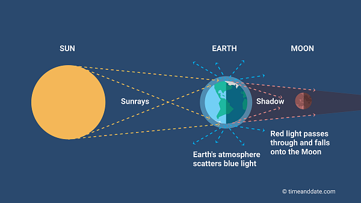

# Bloodmoon

The March 3rd bloodmoon really inspired me to add eclipses to my moon phase website. Before humanity has ever known what and why
eclipse happens it signals doom and death, it strikes fear within us that we try to find ways to counter such bad luck. Who wouldn't be? The sun just slowly vanished. Now that we understand it, it's such a cool phenomemon that fills you with awe and wonder. 

That said I will be implementing where and when an eclipse will take place, and what kind. I'm still debating wether to announce the eclipse on the website or if the user selected that date and then only will the website say that there's an eclipse occuring that day. Maybe if my CSS brain can do it, I can try and make some eclipse animation.

This is how bloodmoon happens btw.

